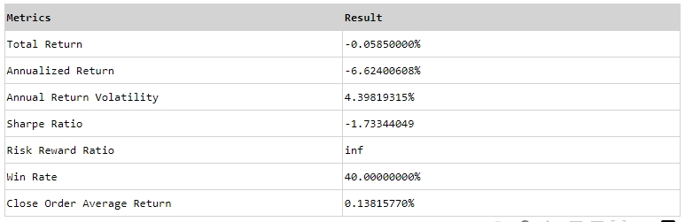
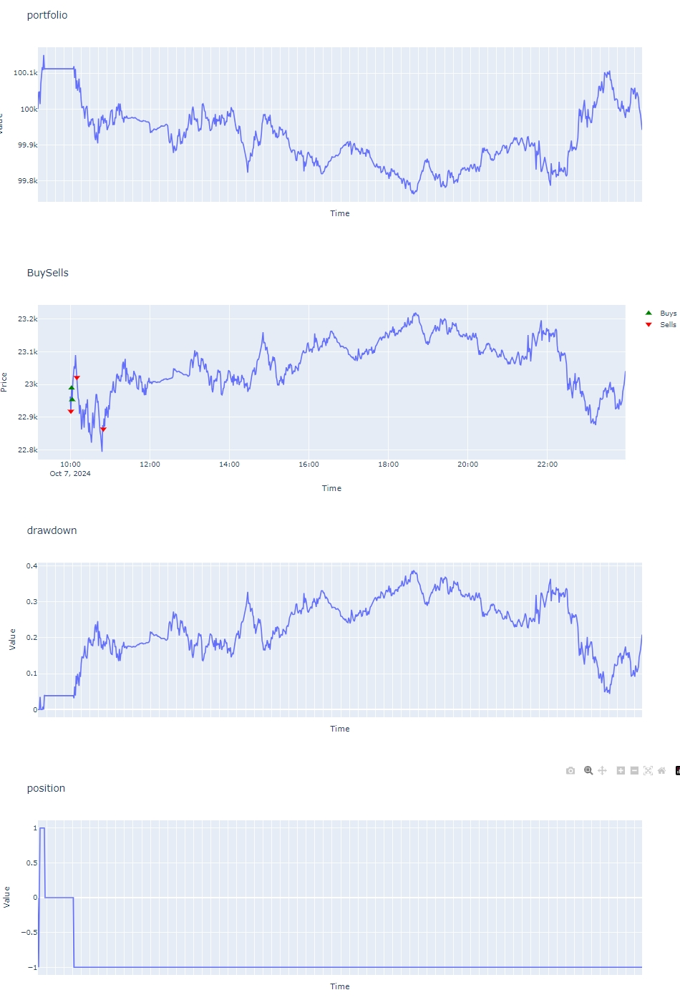

# 开始你的第一个Backtrader策略

## 1 Backtrader策略基本介绍

一个最简单的Backtrader策略程序由三部分组成
- 策略引擎（Cerebro）
- 数据源（Data Feed）
- 策略（Strategy）

一个最简单的Backtrader策略程序如下:

```python
import backtrader as bt
# 数据源的引入
# MyFeed为回测数据源
from ffquant.feeds.MyFeed import MyFeed
import pytz

# 策略方法
class SimpleStrategy(bt.Strategy):
    def __init__(self):
        super(SimpleStrategy, self).__init__()

    # 每次数据源 (此处按照MyFeed定义是CAPITALCOM:HK50的行情数据) 更新都会触发, 实现具体策略逻辑
    # self中包含市场行情、行情指标、账户余额、仓位等, 具体参考下文 3 策略属性
    def next(self):
        dt = self.data.datetime.datetime(0).replace(tzinfo=pytz.utc).astimezone().strftime("%Y-%m-%d %H:%M:%S")
        # 打印当前时间及这个时间点的收盘价
        print(f"dt: {dt}, close[0]: {self.data.close[0]}")

if __name__ == '__main__':
    # 策略引擎的初始化
    cerebro = bt.Cerebro()
    # 初始化数据源, 具体参数参考Reference - MyFeed
    my_data = MyFeed(symbol="CAPITALCOM:HK50", start_time="2024-10-07 10:00:00", end_time="2024-10-07 23:59:00")
    # 加入数据源和策略方法
    cerebro.adddata(my_data)
    cerebro.addstrategy(SimpleStrategy)
    # 启动策略引擎
    cerebro.run()
```

## 2 Backtrader基础概念 

这里只介绍写策略时需了解的基础原理，更多概念语法可查询Backtrader官方文档 <https://www.backtrader.com/docu/>

### 2.1 线（Lines）

数据源（Data Feeds）、指标（Indicators）和策略（Strategies）都有线（lines）。线是由一系列按时间周期连续的点组成的，每一个点代表那个时间点的数据。比如市场行情的数据源（Data Feed）通常有以下数据：

- 日期时间（DateTime）
- 开盘价（Open）
- 最高价（High）
- 最低价（Low）
- 收盘价（Close）
- 成交量（Volume）
- 成交金额（TurnOver）

例如，随时间变化的“开盘价（Open）”序列就是一条线。因此，一个市场行情的数据源通常有 7 条线。

### 2.2 访问线（Lines）的值的索引（Index）说明

在访问一条线中的值时，当前时间点使用索引 0 进行访问，上一个时间点使用索引-1访问，上上一个时间点使用索引-2访问，上上上一个时间点使用索引-3访问，依次类推。

```python
self.data.close[0]  # 访问当前K线的close价格
```

```python
self.data.close[-1] # 访问上一根K线的close价格
```

### 2.3 数据源（Data Feeds）的一般语法

在一个策略Strategy中，至少有1个市场行情数据源，也可加多个市场行情数据源，self.datas表示所有的市场行情数据源的列表，self.datas[0]表示第一个市场行情数据源，self.datas[1]表示第二个市场行情数据源，在策略开发中经常
会用到以下的语法糖：
```python
self.data # 表示 self.datas[0]
```

```python
self.dataX # 表示 self.datas[X]
```

## 3 策略（Strategy）的属性

### 3.1 市场行情

self.data，包含了所有加入到引擎中的市场行情数据源，可用行情数据类型详见 [Reference - MyFeed - 内部Lines](#MyFeed)。

<span style="color:red; font-weight:bold;">目前我们系统策略回测编写中只使用到1个市场行情，即self.datas[0]，并且都是1分钟级别行情数据</span>

### 3.2 券商Broker

self.broker.getcash()返回可用余额，单位为港币；

self.broker.getvalue()返回账户价值，账户价值 = 账户可用余额 + 未实现盈亏；

### 3.3 仓位

self.position.size，返回仓位数量，大于0表示多头仓位，小于0表示空头仓位

### 3.4 指标（Indicators）

可在策略的构造函数init中声明指标a，在next方法中通过self.a访问该指标，self.a[0]指标的当前值，self.a[-1]指标的上一个值。

目前指标分为内部指标和backtrader可用指标，<span style="color:red; font-weight:bold;">目前内部信号都是1分钟级别信号</span>，可用内部指标如下：
- **Trend** 行情未来趋势的预测指标信号，详见[Reference - Trend](#Trend)
- **TurningPoint** 对行情转折预测的信号，详见[Reference - TurningPoint](#TurningPoint)
  
如何给策略加上指标，代码示例如下：
```python
import backtrader as bt
from ffquant.feeds.MyFeed import MyFeed
# 引入内部指标Trend
from ffquant.indicators.Trend import Trend

import pytz

class SimpleStrategy(bt.Strategy):
    def __init__(self):
        super(SimpleStrategy, self).__init__()
        # 声明指标
        self.trend = Trend(symbol="CAPITALCOM:HK50")
        # 引入backtrader自带的指标
        self.sma = bt.indicators.SimpleMovingAverage(self.datas[0], period=10)

    def next(self):
        dt = self.data.datetime.datetime(0).replace(tzinfo=pytz.utc).astimezone().strftime("%Y-%m-%d %H:%M:%S")
        print(f"dt: {dt}, close[0]: {self.data.close[0]}, trend[0]: {self.trend[0]}")


if __name__ == '__main__':
    cerebro = bt.Cerebro()
    my_data = MyFeed(symbol="CAPITALCOM:HK50", start_time="2024-10-07 10:00:00", end_time="2024-10-07 23:59:00")
    cerebro.adddata(my_data)
    cerebro.addstrategy(SimpleStrategy)
    cerebro.run()

```

## 4 如何下单？

 - 买接口 self.buy(exectype=bt.Order.Market, size=1)
 - 卖接口 self.sell(exectype=bt.Order.Market, size=1)

buy()和sell()的可用参数说明如下:
|参数|类型|默认值|说明|
|---|---|---|---|
|exectype|int|bt.Order.Market|订单类型 bt.Order.Market或者bt.Order.Limit|
|price|float|None|订单价格，只在exectype为bt.Order.Limit有效|
|size|int|None|正整数，下单数量|

示例，我们给上面的策略加上简单的下单的逻辑，如下：

```python
import backtrader as bt
from ffquant.feeds.MyFeed import MyFeed
from ffquant.indicators.Trend import Trend
import pytz

class SimpleStrategy(bt.Strategy):
    def __init__(self):
        super(SimpleStrategy, self).__init__()
        self.trend = Trend(symbol="CAPITALCOM:HK50")

    def next(self):
        dt = self.data.datetime.datetime(0).replace(tzinfo=pytz.utc).astimezone().strftime("%Y-%m-%d %H:%M:%S")
        print(f"dt: {dt}, close[0]: {self.data.close[0]}, trend[0]: {self.trend[0]}")
        # 当trend为1且当前close价格大于上一个close价格时，买入
        if self.trend[0] == 1 and self.data.close[0] > self.data.close[-1]:
            # 触发买1张HK50
            self.buy(size=1)
        # 当trend为-1且当前close价格小于上一个close价格时，卖出
        elif self.trend[0] == -1 and self.data.close[0] < self.data.close[-1]:
            # 触发卖1张HK50
            self.sell(size=1)

if __name__ == '__main__':
    cerebro = bt.Cerebro()
    my_data = MyFeed(symbol="CAPITALCOM:HK50", start_time="2024-10-07 10:00:00", end_time="2024-10-07 23:59:00")
    cerebro.adddata(my_data)
    cerebro.addstrategy(SimpleStrategy)
    cerebro.run()
```

## 5 策略回测性能说明

我们可以使用run_and_show_performance函数来图形化展示策略的性能，示例如下：
```python
import backtrader as bt
from ffquant.feeds.MyFeed import MyFeed
from ffquant.indicators.Trend import Trend
import pytz
from ffquant.plot.perf import run_and_show_performance

class SimpleStrategy(bt.Strategy):
    def __init__(self):
        super(SimpleStrategy, self).__init__()
        self.trend = Trend(symbol="CAPITALCOM:HK50")

    def next(self):
        dt = self.data.datetime.datetime(0).replace(tzinfo=pytz.utc).astimezone().strftime("%Y-%m-%d %H:%M:%S")
        print(f"dt: {dt}, close[0]: {self.data.close[0]}, trend[0]: {self.trend[0]}")
        
        if self.trend[0] == 1 and self.data.close[0] > self.data.close[-1]:
            self.buy(size=1)
        elif self.trend[0] == -1 and self.data.close[0] < self.data.close[-1]:
            self.sell(size=1)


if __name__ == '__main__':
    cerebro = bt.Cerebro()
    my_data = MyFeed(symbol="CAPITALCOM:HK50", start_time="2024-10-07 10:00:00", end_time="2024-10-07 23:59:00")
    cerebro.adddata(my_data)
    cerebro.addstrategy(SimpleStrategy)
    # 不要调用cerebro.run() 策略执行交给run_and_show_performance函数负责
    # cerebro.run() 
    run_and_show_performance(cerebro)
```

- **总体性能**

(图中的数值仅作示例)



总体性能的分项指标说明如下：

|分项指标|说明|
|------|------|
|Total Return |回测周期结束时的账户价值相对于开始时的收益率|
|Annualized Return|年化收益率 每日交易时间390分钟 一年交易日252天|
|Annual Return Volatility|年化收益波动率|
|Sharpe Ratio|无风险年化利率可以通过 run_and_show_performance(cerebro, riskfree_rate=0.05)这样的形式指定|
|Risk Reward Ratio|盈亏比 平仓单的平均收益除以平仓单的平均亏损|
|Win Rate|盈利的平仓单占总平仓单的比例|
|Close Order Average Return|平仓单的平均收益率|

- **账户价值、买卖点、回撤、仓位**

(图中的数值仅作示例)




恭喜你，你完成了你的第一个Backtrader策略。你可以继续查阅本文档的其他部分优化策略。

# ffquant库Reference

## 交易品种symbol

- CAPITALCOM:HK50


## MyFeed

MyFeed类是对回测时的市场行情数据源的抽象，此数据源仅用于回测目的

**引入方式**

```python
from ffquant.feeds.MyFeed import MyFeed
```

**构造函数**

|参数名|类型|默认值|说明|
|-------|-------|-------|-------|
|start_time|string|无|用于回测的市场行情数据源的开始时间 格式为yyyy-mm-dd HH:MM:SS|
|end_time|string|无|用于回测的市场行情数据源的结束时间 格式为yyyy-mm-dd HH:MM:SS|
|symbol|string|无|交易品种 比如:CAPITALCOM:HK50|
|prefetch_size|string|60|用于性能优化，预取数据的长度|
|debug|boolean|False|是否打印debug日志|

**内部Lines**

|Line名称|类型|说明|
|------|------|------|
|datetime|float|距离1970年1月1日的天数，转换为字符串 self.data.datetime.datetime(0).replace(tzinfo=pytz.utc).astimezone().strftime("%Y-%m-%d %H:%M:%S")|
|open|float|open价格，在策略或者指标中的访问当前时刻数据：self.data.open[0]|
|high|float|high价格，在策略或者指标中的访问当前时刻数据：self.data.high[0]|
|low|float|low价格，在策略或者指标中的访问当前时刻数据：self.data.low[0]|
|close|float|close价格，在策略或者指标中的访问当前时刻数据：self.data.close[0]|
|volume|float|volume交易量，在策略或者指标中的访问当前时刻数据：self.data.volume[0]|
|turnover|float|turnover交易额，在策略或者指标中的访问当前时刻数据：self.data.turnover[0]|

**示例代码**

```python
cerebro = bt.Cerebro()
my_data = MyFeed(symbol="CAPITALCOM:HK50", start_time="2024-10-07 00:00:00", end_time="2024-10-07 12:00:00")
cerebro.adddata(my_data)
cerebro.run()
```

## Trend

Trend类是对行情未来趋势的预测指标信号，具体值为：

|值|说明|
|------|------|
|1 |预测为牛市|
|0 |表示无方向判断|
|-1 |预测为熊市|
|-ref |信号断开|

**引入方式**

```python
from ffquant.indicators.Trend import Trend
```

**构造函数**

|参数名|类型|默认值|说明|
|-------|-------|-------|-------|
|symbol|string|无|交易品种 比如:CAPITALCOM:HK50|
|max_retries|int|30|获取当前最新的信号时，重试的最大次数|
|prefetch_size|int|60|用于性能优化，预取数据的长度|
|debug|boolean|False|是否打印debug日志|

**内部Lines**

|Line名称|类型|说明|
|------|------|------|
|trend|float|在策略或者指标中的访问方式：self.trend[0]|

**示例代码**

```python
class SimpleStrategy(bt.Strategy):
    def __init__(self):
        super(SimpleStrategy, self).__init__()
        self.trend = Trend(symbol="CAPITALCOM:HK50")

    def next(self):
        dt = self.data.datetime.datetime(0).replace(tzinfo=pytz.utc).astimezone().strftime("%Y-%m-%d %H:%M:%S")
        print(f"dt: {dt}, trend[0]: {self.trend[0]}")

if __name__ == '__main__':
    cerebro = bt.Cerebro()
    my_data = MyFeed(symbol="CAPITALCOM:HK50", start_time="2024-10-07 10:00:00", end_time="2024-10-07 23:59:00")
    cerebro.adddata(my_data)
    cerebro.addstrategy(SimpleStrategy)
    cerebro.run()
```

## TurningPoint

TurningPoint类是对行情转折预测的信号，具体值为：

|值|说明|
|------|------|
|1 |预测转折向上|
|0 |表示无方向判断|
|-1 |预测转折向下|
|-ref |信号断开|

**引入方式**

```python
from ffquant.indicators.TurningPoint import TurningPoint
```

**构造函数**

|参数名|类型|默认值|说明|
|-------|-------|-------|-------|
|symbol|string|无|交易品种 比如:CAPITALCOM:HK50|
|max_retries|int|30|获取当前最新的信号时，重试的最大次数|
|prefetch_size|int|60|用于性能优化，预取数据的长度|
|debug|boolean|False|是否打印debug日志|

**内部Lines**

|Line名称|类型|说明|
|------|------|------|
|tp|float|在策略或者指标中的访问方式：self.tp[0]|

**示例代码**

```python
class SimpleStrategy(bt.Strategy):
    def __init__(self):
        super(SimpleStrategy, self).__init__()
        self.tp = TurningPoint(symbol="CAPITALCOM:HK50")

    def next(self):
        dt = self.data.datetime.datetime(0).replace(tzinfo=pytz.utc).astimezone().strftime("%Y-%m-%d %H:%M:%S")
        print(f"dt: {dt}, tp[0]: {self.tp[0]}")

if __name__ == '__main__':
    cerebro = bt.Cerebro()
    my_data = MyFeed(symbol="CAPITALCOM:HK50", start_time="2024-10-07 10:00:00", end_time="2024-10-07 23:59:00")
    cerebro.adddata(my_data)
    cerebro.addstrategy(SimpleStrategy)
    cerebro.run()
```


## 显示回测性能

run_and_show_performance函数用于显示回测策略的性能表现，如总收益、仓位变化、买卖点等。

**引入方式**

```python
from ffquant.plot.perf import run_and_show_performance
```

**参数说明**
|参数名|类型|默认值|说明|
|-------|-------|-------|-------|
|cerebro|bt.Cerebro|无|交易引擎Cerebro实例|
|riskfree_rate|float|0.01|无风险利率|
|use_local_dash_url|boolean|False|开发团队内部使用，在用IP地址访问策略开发平台时，传入此参数True显示策略性能界面|
|debug|boolean|False|是否打印debug日志|

**示例代码**

```python
class SimpleStrategy(bt.Strategy):
    def __init__(self):
        super(SimpleStrategy, self).__init__()

    def next(self):
        dt = self.data.datetime.datetime(0).replace(tzinfo=pytz.utc).astimezone().strftime("%Y-%m-%d %H:%M:%S")
        print(f"dt: {dt}, close[0]: {self.data.close[0]}")

if __name__ == '__main__':
    cerebro = bt.Cerebro()
    my_data = MyFeed(symbol="CAPITALCOM:HK50", start_time="2024-10-07 10:00:00", end_time="2024-10-07 23:59:00")
    cerebro.adddata(my_data)
    cerebro.addstrategy(SimpleStrategy)
    run_and_show_performance(cerebro)
```
